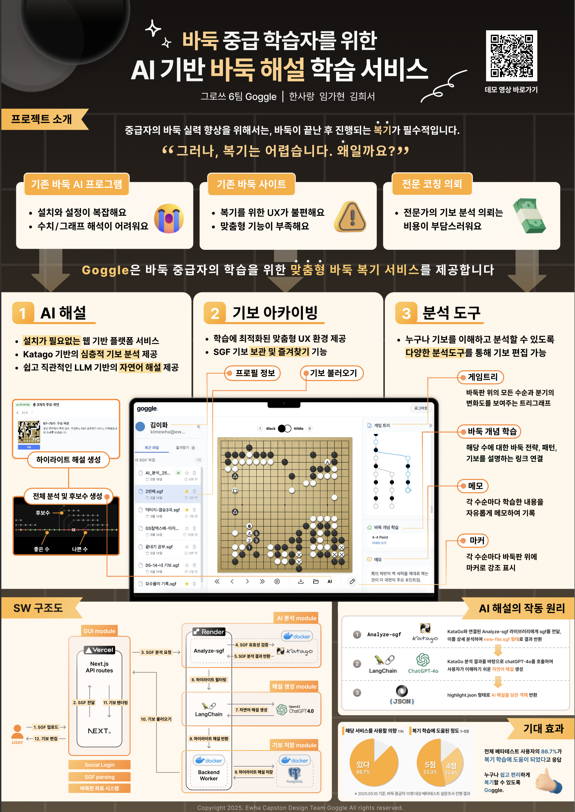
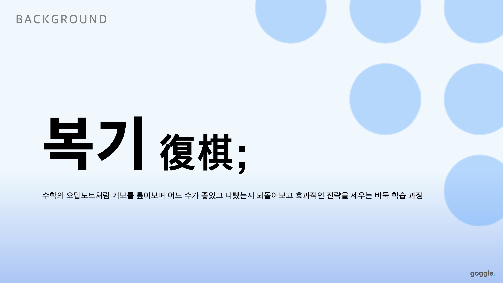
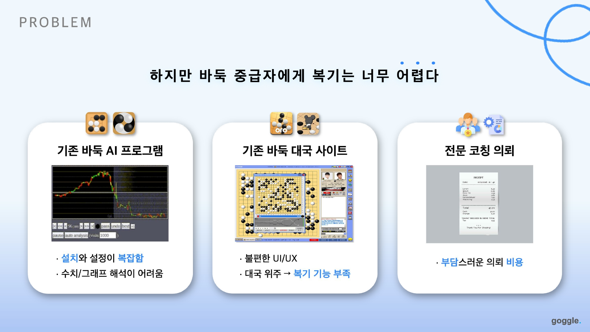
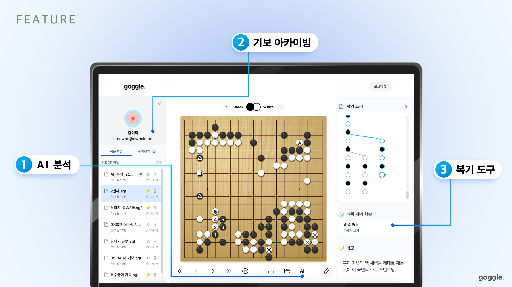
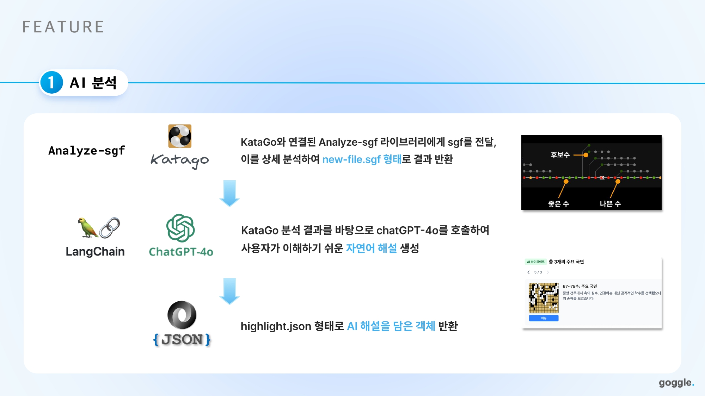
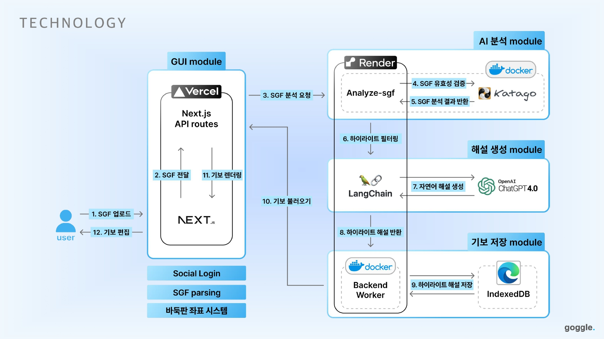

# Goggle – AI-Powered Go Game Review Platform  
*An AI-assisted Go game review service designed to help intermediate players improve through personalized, explainable analysis.*  

<br>

---

<br>

## 프로젝트 개요 (Overview)

**Goggle**은 바둑(Go) 대국 후 가장 중요한 과정인 **복기(復棋)**를  
더 쉽고, 더 효과적으로 수행할 수 있도록 돕는 **웹 기반 AI 바둑 복기 서비스**입니다.

이 서비스는 KataGo 기반 AI 분석과  
LLM(Large Language Model)을 활용한 **자연어 해설**을 결합하여,  
중·고급 아마추어 바둑 유저가 “왜 이 수가 문제였는지”, “어떻게 개선할 수 있는지”를 **직관적으로 이해하고 학습**할 수 있도록 설계되었습니다.

- 프로젝트 유형: **캡스톤 디자인 / 산학 연계 과제**  
- 팀명: **06-Goggle**  
- 프로젝트 키워드: **바둑, 복기, KataGo, LangChain, SGF**  
- 대상 사용자: **중·고급 아마추어 바둑 팬**

<br>

Goggle is a web-based Go game review platform  
designed to make post-game analysis (**review, 복기**)  
easier and more effective for intermediate and advanced amateur players.

The service combines **KataGo-powered AI analysis** with  
**LLM-generated natural language explanations**,  
enabling players to intuitively understand *why a move was suboptimal*  
and *how to improve their play*.

- Project type: **Capstone design / Industry-linked course**  
- Team: **06-Goggle**  
- Keywords: **Go, game review, KataGo, LangChain, SGF**  
- Target users: **Intermediate to advanced amateur Go players**

<br>

---

<br>

## 문제 정의 (Target Customer)


바둑 실력 향상에 있어 **복기(復棋)**는 핵심 과정이지만,  
아마추어에게는 여전히 **진입 장벽**이 높습니다.

### Pain Points
**1. 셀프 복기는 어렵고, 전문가 도움은 비용 부담**  
- 복기는 많은 시간과 집중력을 요함  
- 프로에게 받는 코칭은 비용 부담과 접근성 문제 존재

**2. 기존 AI 도구는 어렵고 직관적이지 않음**  
- 설치 및 설정이 복잡  
- 승률 그래프 중심 → 실질적 이해로 연결되지 않음

**3. 사용자 경험 문제**  
- 기보 업로드 및 분석 확인 과정이 번거로움  
- 중요한 장면 재확인 어려움, 원하는 기능 찾기 어려움

<br>

**1. Self-review is hard and expert coaching is expensive**  
- Reviewing requires significant time and concentration  
- Professional coaching is costly and not always accessible

**2. Existing AI tools are complex and unintuitive**  
- Installation and setup are complicated  
- Win-rate graphs and raw data do not translate into meaningful understanding

**3. Poor user experience**  
- Uploading SGF and reviewing analysis is cumbersome  
- Hard to revisit key moments and find desired features

<br>

---

<br>

## 해결 방식 (Solution)


Goggle은 복기를  
**학습 가능한 경험**으로 재정의하고,  
AI와 LLM을 활용해 **중급자 친화적 복기 환경**을 제공합니다.

Goggle redefines Go game review (**복기**)  
as a **learnable and guided experience**,  
providing an intermediate-friendly environment using AI and LLM.



### Key Approach
- **AI**: 기보 분석  
- **LLM**: 자연어 해설 생성  
- 설치 없이 사용할 수 있는 **웹 기반 서비스**

- **AI**: Game analysis  
- **LLM**: Natural language explanation generation  
- Web-based → No installation required

<br>

### Value Proposition
- 웹 기반 서비스 → 접근성 향상  
- 맞춤형 AI 해설 → 학습 효율 극대화  
- 기보 아카이빙 → 개인 학습 기록 관리

- Web platform → improved accessibility  
- Personalized AI commentary → maximize learning efficiency  
- SGF archiving → manage personal review history

<br>

---

<br>

## 주요 기능 (Key Features)


**1. SGF 기보 업로드 및 아카이빙**  
- SGF 파일 업로드 → 분석, 결과 저장 및 반복 학습 가능

**2. SGF 에디터**  
- 수순 이동, 분기 탐색(Game Tree)  
- 중요 수 마커 및 메모 추가  
- 학습용 개인 기록

**3. AI 기보 분석 (KataGo)**  
- 승률 변화, 추천 수, 실착 구간 분석  
- 객관적 데이터 기반 복기

**4. AI 하이라이트 해설 (LangChain + LLM)**  
- 핵심 장면 자동 탐지  
- 자연어 해설 제공  
- 중급자 눈높이 맞춤

<br>

**1. SGF upload & archiving**  
- Upload SGF → analysis, save results, review repeatedly

**2. SGF editor**  
- Navigate moves, explore variations (Game Tree)  
- Add markers and comments for key moves  
- Personal learning notes

**3. AI game analysis (KataGo)**  
- Win-rate changes, recommended moves, suboptimal moves  
- Objective, data-driven review

**4. AI highlight commentary (LangChain + LLM)**  
- Auto-detect critical moments  
- Provide natural language explanations  
- Tailored for intermediate players

<br>

---

<br>

## 역할 및 기여도 (Role & Contribution)

### 팀 구성 / Team
- **한사랑**: AI / Back-end  
- **임가현**: Front-end  

### 담당 역할 / My Contribution
- 서비스 UX 설계 및 Flow 설계  
- SGF 에디터 UI 구현  
- Front-end 아키텍처 및 상태 관리  
- 팀 내 기획·개발 소통 브릿지

- Designed service UX and user flows  
- Implemented SGF editor UI  
- Managed front-end architecture and state  
- Acted as bridge between planning and development

<br>

---

<br>

## 결과 및 인사이트 (Outcomes & Learnings)

- AI 분석보다 **설명 가능성**이 핵심  
- 문제 정의와 사용자 맥락의 중요성 체감  
- 복잡한 시스템을 **사용자 중심 서비스**로 통합  
- 기획·디자인·개발 연결 경험 강화

- Realized the importance of **explainability over raw AI performance**  
- Learned to prioritize problem definition and user context  
- Integrated complex system into **user-centered service**  
- Strengthened experience connecting planning, design, and development

<br>

---

<br>

## 프로젝트 배경 (Context)

이 프로젝트는 **이화여자대학교 컴퓨터공학과 캡스톤 디자인 과목** 산학 연계 팀 프로젝트입니다.  
포트폴리오 목적으로, 문제 정의 → 솔루션 설계 → 구현 → 통합 과정을 정리했습니다.

<br>

This project was conducted as part of a **capstone design course** at Ewha Womans University,  
documenting end-to-end product development for portfolio purposes,  
from problem definition to solution design, implementation, and integration.

<br>

---

<br>

## 실행 방법 (Run Locally)

```bash
git clone https://github.com/khlang12/Goggle-demo.git
npm install
npm run dev
